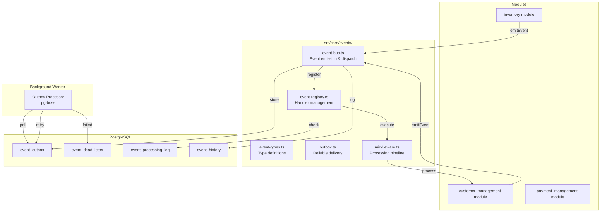

# Event-Driven Architecture

A production-ready, type-safe event system for inter-module communication in the Next.js application.

## Overview

The event system provides reliable, asynchronous communication between modules using an event-driven architecture. It includes:

- **Type-safe event emission** with full TypeScript support
- **Outbox pattern** for guaranteed event delivery
- **Idempotency** to prevent duplicate processing
- **Retry logic** with exponential backoff
- **Circuit breakers** for resilience
- **Observability** with event history and logging
- **Query pattern** for synchronous request-reply scenarios

## Architecture



## Quick Start

### 1. Install Dependencies

```bash
npm install pg-boss
```

### 2. Run Database Migrations

```bash
npm run db:generate
npm run db:migrate
```

### 3. Start Event Worker

```bash
npm run event:worker
```

### 4. Bootstrap Event Handlers

In your app initialization (e.g., `src/app/layout.tsx` or API route):

```typescript
import { bootstrapEventHandlers } from '@/core/events/bootstrap';

// On app startup
await bootstrapEventHandlers();
```

## Usage Examples

### Emitting Events

```typescript
import { emitEvent } from '@/core/events';

// Emit an event (fire-and-forget)
await emitEvent('inventory:product.created', {
  productId: '123',
  name: 'Widget',
  quantity: 100,
}, 'inventory');
```

### Registering Event Handlers

```typescript
import { registerEventHandler } from '@/core/events';
import type { Event } from '@/core/events';

// Register a handler
registerEventHandler('inventory:product.created', {
  handler: async (event: Event) => {
    console.log('Product created:', event.data);
    // Your handler logic here
  },
  module: 'customer_management',
  retryPolicy: {
    maxAttempts: 3,
    backoffMs: 1000,
    exponentialBackoff: true,
  },
  timeout: 5000,
  idempotencyKey: (event) => `product-${event.data.productId}`,
});
```

### Query Pattern (Request-Reply)

```typescript
import { queryEvent } from '@/core/events';

// Query for stock availability
const response = await queryEvent('inventory:stock.check', {
  productId: '123',
  requestedQuantity: 10,
}, 'payment_management', 5000); // 5 second timeout

if (response.data?.available) {
  console.log('Stock available:', response.data.currentQuantity);
}
```

### Module Integration Pattern

Each module should export its events and handlers:

```typescript
// src/modules/inventory/events/index.ts
import { emitEvent } from '@/core/events';

export interface ProductCreatedData {
  productId: string;
  name: string;
  quantity: number;
}

export const inventoryEvents = {
  productCreated: async (data: ProductCreatedData) => {
    await emitEvent('inventory:product.created', data, 'inventory');
  },
};

export const inventoryEventHandlers = [
  {
    eventName: 'payment:order.completed',
    handler: async (event) => {
      // Handle order completion
    },
    options: {
      module: 'inventory',
      handlerId: 'inventory-order-completed',
    },
  },
];
```

## Configuration

Configure the event system via environment variables:

```env
# Enable/disable event system
EVENT_SYSTEM_ENABLED=true

# Outbox polling interval (milliseconds)
EVENT_OUTBOX_POLLING_INTERVAL=5000

# Default retry settings
EVENT_DEFAULT_MAX_RETRIES=3
EVENT_DEFAULT_BACKOFF_MS=1000
EVENT_EXPONENTIAL_BACKOFF=true
EVENT_BACKOFF_JITTER=true

# Default handler timeout (milliseconds)
EVENT_DEFAULT_TIMEOUT=30000

# Maximum event payload size (bytes)
EVENT_MAX_PAYLOAD_SIZE=1048576

# Enable event history logging
EVENT_HISTORY_ENABLED=true

# Enable immediate processing (bypass outbox)
EVENT_IMMEDIATE_PROCESSING=false

# Circuit breaker settings
EVENT_CIRCUIT_BREAKER_THRESHOLD=5
EVENT_CIRCUIT_BREAKER_TIME_WINDOW=60000
EVENT_CIRCUIT_BREAKER_RECOVERY_TIMEOUT=30000
```

Or programmatically:

```typescript
import { setEventConfig } from '@/core/events';

setEventConfig({
  enabled: true,
  outboxPollingInterval: 5000,
  defaultTimeout: 30000,
});
```

## Database Tables

The event system uses four database tables:

### `event_outbox`
Stores events for reliable delivery using the transactional outbox pattern.

### `event_dead_letter`
Stores events that failed after maximum retries.

### `event_processing_log`
Tracks processed events for idempotency checks.

### `event_history`
Stores all emitted events for observability and debugging.

## Features

### Type Safety

Full TypeScript support with type-safe event names and payloads:

```typescript
// Define event types
interface ProductCreatedData {
  productId: string;
  name: string;
}

// Type-safe emission
await emitEvent<ProductCreatedData>('inventory:product.created', {
  productId: '123',
  name: 'Widget',
}, 'inventory');
```

### Idempotency

Prevent duplicate processing with idempotency keys:

```typescript
registerEventHandler('payment:order.completed', {
  handler: async (event) => {
    // Process order
  },
  options: {
    module: 'inventory',
    idempotencyKey: (event) => `order-${event.data.orderId}`,
  },
});
```

### Retry Logic

Automatic retries with exponential backoff:

```typescript
registerEventHandler('external:api.call', {
  handler: async (event) => {
    // Call external API
  },
  options: {
    module: 'integration',
    retryPolicy: {
      maxAttempts: 5,
      backoffMs: 1000,
      exponentialBackoff: true,
      jitter: true,
    },
  },
});
```

### Circuit Breaker

Protect against cascading failures:

```typescript
// Circuit breaker automatically opens after threshold failures
// Prevents overwhelming failing services
```

### Middleware

Built-in middleware for logging, validation, error handling, and more:

- **Logging**: Log all events and handler execution
- **Validation**: Validate payloads with Zod schemas
- **Idempotency**: Check processing log before execution
- **Error Handling**: Catch and log errors with context
- **Circuit Breaker**: Track failures and open circuit
- **Timeout**: Enforce handler timeouts

## Best Practices

### 1. Keep Event Payloads Small

Store large data in the database and pass IDs in events:

```typescript
// Good
await emitEvent('product:created', {
  productId: '123',
}, 'inventory');

// Bad
await emitEvent('product:created', {
  productId: '123',
  fullProductData: { /* 10KB of data */ },
}, 'inventory');
```

### 2. Use Descriptive Event Names

Follow the pattern: `module:action` or `module:resource.action`:

```typescript
'inventory:product.created'
'payment:order.completed'
'customers:customer.updated'
```

### 3. Always Use Idempotency Keys

For critical operations, always provide an idempotency key:

```typescript
idempotencyKey: (event) => `${event.metadata.eventName}-${event.data.id}`
```

### 4. Handle Errors Gracefully

Event handlers should handle errors internally:

```typescript
registerEventHandler('external:api.call', {
  handler: async (event) => {
    try {
      // Call external API
    } catch (error) {
      // Log error, send notification, etc.
      // Don't let errors propagate
    }
  },
  options: { module: 'integration' },
});
```

### 5. Use Query Pattern Sparingly

The query pattern is synchronous and blocks. Use it only when you need an immediate response:

```typescript
// Use for: Stock checks, permission checks, etc.
// Avoid for: Long-running operations, external API calls
```

### 6. Monitor Dead Letter Queue

Regularly check the `event_dead_letter` table for failed events:

```sql
SELECT * FROM event_dead_letter 
WHERE failed_at > NOW() - INTERVAL '1 day'
ORDER BY failed_at DESC;
```

## Testing

Use the test utilities for testing events:

```typescript
import { testEventBus, createTestEvent } from '@/core/events/__tests__/test-helpers';

// Clear handlers
testEventBus.clear();

// Wait for event
const event = await testEventBus.waitForEvent('test:event', 5000);

// Mock handler
const mock = testEventBus.mockHandler('test:event');
await emitEvent('test:event', { test: 'data' }, 'test');
expect(mock.wasCalled()).toBe(true);
```

## Performance Considerations

1. **Event Payload Size**: Keep payloads under 1KB. Store large data in DB.
2. **Handler Execution**: Use parallel execution when possible (default).
3. **Database Indexes**: All event tables are indexed for efficient querying.
4. **Batch Processing**: The outbox processor processes events in batches.
5. **Connection Pooling**: Use connection pooling for database operations.

## Troubleshooting

### Events Not Processing

1. Check if event system is enabled: `EVENT_SYSTEM_ENABLED=true`
2. Verify event worker is running: `npm run event:worker`
3. Check outbox table for pending events: `SELECT * FROM event_outbox WHERE status = 'pending'`

### Handler Not Executing

1. Verify handler is registered: Check logs for registration messages
2. Check for errors in handler execution
3. Verify event name matches exactly (case-sensitive)

### High Dead Letter Queue

1. Review failed events: `SELECT * FROM event_dead_letter ORDER BY failed_at DESC`
2. Check error messages for patterns
3. Adjust retry policies if needed
4. Fix underlying issues causing failures

## API Reference

### Core Functions

- `emitEvent(eventName, data, sourceModule, options?)` - Emit an event
- `queryEvent(eventName, data, sourceModule, timeout?)` - Query with response
- `registerEventHandler(eventName, handler, options)` - Register handler
- `unregisterEventHandler(eventName, handlerId)` - Unregister handler

### Configuration

- `getEventConfig()` - Get current configuration
- `setEventConfig(updates)` - Update configuration
- `isEventSystemEnabled()` - Check if enabled

### Worker

- `startEventWorker()` - Start background worker
- `stopEventWorker()` - Stop background worker

## License

MIT

